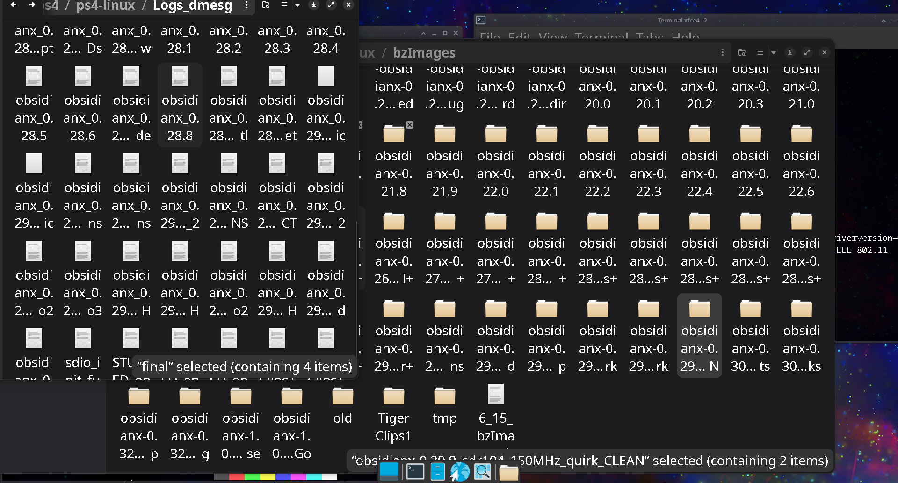
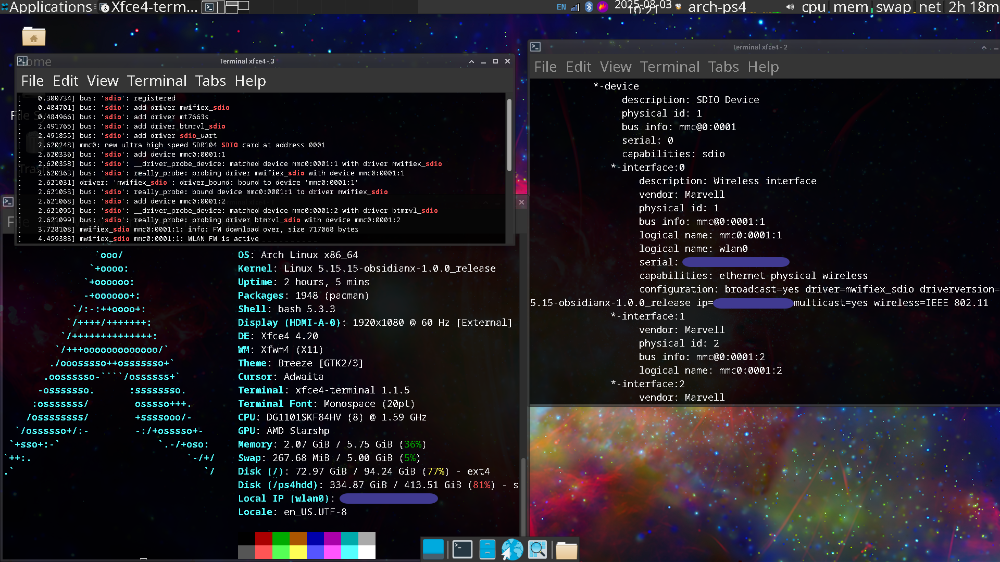

Linux Kernel - On the Sony PlayStation 4
========================================

This is a Linux kernel source tree tailored to run on exploitable PlayStation 4 systems with various subsystem patches from
[fail0verflow](https://github.com/fail0verflow/ps4-linux),
[eeply](https://github.com/eeply/ps4-linux),
[Ps3itaTeam](https://github.com/Ps3itaTeam/ps4-linux),
[rancido](https://github.com/rancido),
valeryy (no GitHub - contributed to PS4 Baikal southbridges),
[mircoho](https://github.com/ps4gentoo/ps4-linux-5.3.7),
[codedwrench](https://github.com/codedwrench/ps4-linux/),
[tihmstar](https://github.com/tihmstar/ps4-linux/tree/ps4-4.14.93-belize),
[crashniels](https://github.com/crashniels/linux/),
[saya](https://www.youtube.com/channel/UCc20KAcPCj9Ut8IQF3umSjg),
[whitehax0r](https://github.com/whitehax0r/ps4-linux-baikal),
[DFAUS](https://github.com/DFAUS-git/ps4-baikal-5.4.247-kernel), and others.

For a more detailed credits section, check out [this page](https://dionkill.github.io/ps4-linux-tutorial/ending.html#kernel-developers).

This fork originally aimed to make the internal WiFi+Bluetooth modules on specific PlayStation 4 models with the Marvell 88w8897 combo card, internally known as Torus 2, functional. These cards usually fail on default kernels because of PS4 SDHCI and firmware/runtime quirks.

Over time it grew into a broader PS4-focused kernel tree covering graphics hotplug and bridge handling, HDMI audio, GPU clocking, thermal and LED control, fan control, firmware quirks, internal WiFi support, runtime stability, and newer desktop/container-oriented configuration paths.

The current stable integration branch in this repository is `7.0-Stable`. `7.0-Clean` is still present as a clean 7.0 baseline/staging branch, while the `rmux/*` branches are topic branches for focused display, networking, firmware, ICC, UART, runtime, LED/fan, and stability work. Older `6.18.x-Strawberry` branches are retained as previous Strawberry development and fallback lines.

<br>

-------
## Current Status (`7.0-Stable`)

- `7.0-Stable` is the current stable PS4-focused Linux 7.0 integration branch in this repository.
- Hardware Bringup and Stability:
  - Added measurement deadline to x86 PS4 calibration loop to prevent hangs on certain hardware.
  - Hardened ICC IRQ and ioctl handling to improve system stability.
  - Tightened APCIE MSI bookkeeping and hardened MSI paths for Liverpool/Gladius GPUs.
  - Corrected fan threshold milli-Celsius handling and corrected fan threshold logic.
  - Implemented firmware-based EDID loading for PS4 bridges.
  - Fixed Belize bridge enable retry loops and DP retraining logic.
  - Bounded EMC timer stabilization reads to prevent long boot delays.
- Graphics and Audio:
  - Added warnings for Liverpool SDMA ring test failures.
  - Removed high-frequency debug logging from Radeon CIK interrupts.
  - Fixed HDMI audio on Liverpool systems via IEC958 initialization.
- Subsystem Fixes:
  - xHCI Aeolia: Replaced printk-based timing hacks with proper `usleep` calls.
  - xHCI Aeolia: Fixed AHCI host activation error paths.
  - ICC: Replaced `mdelay` with `msleep` in shutdown and reboot paths to avoid busy-waiting.
- Networking (Experimental):
  - Advanced `sky2` fixes are being tested in `rmux/sky2/experimental-fixes` to resolve interrupt storms and memory leaks across all PS4 southbridge variations (Aeolia, Belize, Baikal).
- Maintenance:
  - Removed legacy BORE scheduler references.
  - Updated build system to embed PS4 SD8797 firmware.
  - Added new "strawberry" boot banner.

<br>

-------
## Console Models and Southbridge

The CUH-1216/1215 models are definitively known to have Torus 2 models with problematic WiFi, along with some 11xx models with similar WiFi issues. The table below is conservative and combines historical compatibility notes with the current 7.0-Stable direction.

| Console Model | Variation | WiFi+BT Chip Present | Known Compatible / Relevant Branches |
|---|---|---|---|
| CUH-1216(A/B) | Phat - Belize B0 | Marvell 88w8897 / SD8897 / Torus 2 | `7.0-Stable`, `6.15.4`, `5.15.15` |
| CUH-1215(A/B) | Phat - Belize | Marvell 88w8897 / SD8897 / Torus 2 | `7.0-Stable`, `6.15.4`, `5.15.15` |
| CUH-1003 | Phat - Aeolia | Unknown | Historically `6.15.4`; test current 7.0-Stable per console |
| CUH-1004A | Phat - Aeolia | Marvell 88w8797 / SD8797 / Torus 1 | Current SD8797 firmware workflow in `7.0-Stable`; historically `6.15.4` |
| CUH-1116A | Phat - Aeolia | Unknown | Historically `6.15.4`; test current 7.0-Stable per console |
| CUH-2215B | Slim - Baikal | Unknown | `5.4.247` |
| CUH-2216A | Slim - Baikal B1 | MediaTek 7668 | `5.4.247` |
| CUH-2216A | Slim - Belize | MediaTek 7668 | `5.15.15`; newer MediaTek fixes in `7.0-Stable` |
| CUH-7116B | Pro - Baikal B1 | Unknown | `5.4.247` |
| CUH-7202B | Pro - Baikal | Unknown | `5.4.247` |

```text
A and B are hard-drive specifications: 500 GB vs 1000 GB.

Aeolia, Belize, and Baikal are console southbridges.
B0, B1, etc. are southbridge subrevisions.
```

### Firmware note for SD8797 / 88w8797

Older SD8797 / 88w8797 Aeolia systems no longer need a separate "no built-in firmware" kernel variant in current builds.

Current builds handle SD8797 firmware through the normal build workflow. The expected custom/Orbis-sourced firmware path is:

```text
extra_firmware/mrvl/sd8797_uapsta.bin
```

GitHub Actions fetches this firmware from the private firmware source before building. Local builders must make sure the file exists in the worktree before running the build. If SD8797 firmware is requested but missing, `build.sh` stops early instead of silently building a bad kernel.

The table above is still conservative. It reflects confirmed reports from older release branches plus current `7.0-Stable` work, but newer 7.0 kernels should still be validated model-by-model.

TODO: Add a fuller list of supported console models, southbridges, WiFi/BT chips, and compatible kernels.

<br>

----
## Fixing the Wireless Card on CUH-1216 / CUH-1215

The main patches which, in combination, fix the CUH-1216/1215 wireless module are:

- [150 MHz rate limit quirk on the 88w8897 card's Function 0](https://github.com/feeRnt/ps4-linux-12xx/commit/df7f7dbb1b0fff6026e159540f029988c8067b70)
- [Added SDIO ID for Function 0](https://github.com/feeRnt/ps4-linux-12xx/commit/f4835fb020010acff2b70e4c5fa9430e07f0073b)
- [SDHCI host quirks for the PlayStation SDHCI host](https://github.com/feeRnt/ps4-linux-12xx/commit/e6f342df7737722d5e27f0ae3974e493c5fe4ca4)

Only `SDHCI_QUIRK2_PRESET_VALUE_BROKEN` appears to be required now.

Additional optional stability work:

- [Extra retries for MMC CMD52/CMD53](https://github.com/feeRnt/ps4-linux-12xx/commit/c57162e5ec7a4aa3af3310a36dc963b5c0298dfe)

The primary culprit behind the failed SDIO initialization appears to be that the card does not reliably support 208 MHz or 200 MHz operation on the PS4 SDHCI host. This causes tuning failures and other command failures during initialization.

You can read more about the search for a solution [from here](https://ps4linux.com/forums/d/221-ps4-phat-wifi-fix-test-marvell-8897-torus-20/14).

Through a lot of trial and error, this workaround eventually landed:

<br>



Here is a screenshot with working internal WiFi and Bluetooth in the logs on an Arch Linux system running on my CUH-1216 console:

<br>



<br>

Hard work paid off.

<br>

----
## Branches

The current branch layout is centered around `7.0-Stable` and topic branches.

### Main 7.0 branches

- `7.0-Stable`: current stable integration branch and recommended branch for normal builds.
- `7.0-Clean`: clean 7.0 baseline/staging branch kept for reference and development.
- `7.0-Clean-commit-cleanup-20260424`: cleanup snapshot from the 7.0-Clean line.
- `7.0-ColorFix`: display/color-fix testing branch.
- `7.0-Server-Test`: server-profile testing branch.
- `7.0-ps4-unified`: older unified 7.0 work branch.
- `7.0-Broken`: broken/testing branch; do not use as a release branch.

### Current topic branches

- `rmux/build/embed-sd8797-firmware`: SD8797 firmware embedding and private firmware workflow.
- `rmux/icc/ps4-icc-hardening`: ICC hardening and cleanup work.
- `rmux/uart/ps4-apcie-8250`: APCIE / 8250 UART work.
- `rmux/display/ps4-bridge-6154-behavior`: bridge behavior work.
- `rmux/display/ps4-fixed-bridge-modes`: fixed bridge mode handling.
- `rmux/display/ps4-safe-60hz-modes`: safe 60 Hz bridge/display modes.
- `rmux/display/ps4-belize-enable-attempts`: Belize bridge enable retry handling.
- `rmux/display/ps4-bridge-enable-state`: bridge enable-state handling.
- `rmux/display/ps4-belize-post-enable-retrain`: DP retraining after Belize bridge enable.
- `rmux/perf/ps4-disable-mtk-powersave`: MediaTek WiFi power-save disabling.
- `rmux/perf/ps4-disable-mwifiex-powersave`: mwifiex power-save disabling.
- `rmux/perf/ps4-fan-skip-duplicate-threshold`: duplicate fan threshold write suppression.
- `rmux/perf/ps4-led-skip-duplicates`: duplicate LED update suppression.
- `rmux/perf/ps4-led-fan-overhead`: LED/fan runtime overhead reduction.
- `rmux/perf/ps4-quiet-icc-boot`: quieter ICC normal-path boot logs.
- `rmux/perf/ps4-runtime-polish`: runtime polish and cleanup.
- `rmux/stability/ps4-pwrbutton-teardown`: power-button input teardown fix.
- `rmux/stability/ps4-led-blocking-callbacks`: blocking LED callback handling.
- `rmux/fixes/ps4-stability-surgical-fixes`: focused PS4 stability fixes.
- `Kollias`: contributor/test branch.

### Older Strawberry branches

- `6.18.21-Strawberry`: previous Strawberry 6.18.21 branch.
- `6.18.21-NoDrmDbg`: 6.18.21 branch with DRM debug changes stripped or adjusted.
- `6.18.21-HotPlug`: 6.18.21 hotplug-focused branch.
- `6.18.21-Strawberry-GpuWork`: 6.18.21 GPU work branch.
- `6.18.20-Strawberry`: previous 6.18.20 Strawberry branch.
- `6.18.20-Strawberry-Main`: 6.18.20 main Strawberry branch.
- `6.18.18-Strawberry`: older 6.18.18 Strawberry branch.

Only `7.0-Stable` should be presented as the current recommended branch. The `rmux/*` branches are development/topic branches, and the older `6.18.x-Strawberry` branches are retained for reference, testing, and fallback.

<br>

---
## Compile and Build

The current workflow is centered around `build.sh`, also called the Strawberry Builder, and the consolidated GitHub Actions workflow `.github/workflows/build-kernel_latest.yaml`.

GitHub Actions:

- Run `build-kernel_latest.yaml` from the Actions tab.
- Pick `profile=Server` or `profile=General`.
- Pick `lto=ThinLTO` or `lto=FullLTO`.
- The workflow fetches the private SD8797 firmware before the build and places it at `extra_firmware/mrvl/sd8797_uapsta.bin`.

Profile summary:

- `Server`: headless/services-oriented, `HZ=250`, `PREEMPT_VOLUNTARY`, performance governor, and container/netfilter stack kept enabled.
- `General`: desktop/gaming-oriented, `HZ=250`, full `PREEMPT`, schedutil/reflex path, cgroup and namespace support enabled, `DMI`/`fw_cfg` sysfs enabled, and netfilter stack stripped.

Local build:

```bash
git clone https://github.com/rmuxnet/ps4-linux-12xx --branch 7.0-Stable --depth=3
# Keep a low depth to save space.

cd ps4-linux-12xx

# Local builds require the custom SD8797 firmware when requested by the config.
# Place it here before building:
# extra_firmware/mrvl/sd8797_uapsta.bin

# Fetch required non-custom firmware into extra_firmware/ and build with the
# General profile using ThinLTO.
./build.sh --option 3 use=General lto=ThinLTO

# Example: build a Server-profile kernel with FullLTO.
./build.sh --option 3 use=Server lto=FullLTO
```

The builder will:

- move `config` to `.config` automatically if needed;
- ensure `CONFIG_EXTRA_FIRMWARE` includes `mrvl/sd8797_uapsta.bin`;
- stop early if the required custom SD8797 firmware is missing;
- fetch every non-custom blob listed in `CONFIG_EXTRA_FIRMWARE` into `extra_firmware/`;
- set `CONFIG_EXTRA_FIRMWARE_DIR` to the local `extra_firmware/` directory;
- apply the selected profile and LTO settings;
- build `bzImage` with LLVM;
- write outputs to `out/`:
  - `bzImage`
  - `.config`
  - `artifact_name.txt`

If you need a more manual path, you can still do:

```bash
mv config .config
make -j"$(nproc)" LLVM=1 olddefconfig
make -j"$(nproc)" LLVM=1 prepare
make -j"$(nproc)" LLVM=1 bzImage
make -j"$(nproc)" LLVM=1 modules
```

<br>

---
## Releases and Downloads

To get pre-compiled kernels, go to the [releases section](https://github.com/rmuxnet/ps4-linux-12xx/releases), then choose a `bzImage` based on your console model, southbridge, and branch requirements.

Read the release notes before booting a kernel. They may contain model-specific notes, firmware details, known regressions, or required userspace changes.

<br>

---
## Contributing

If something does not work on these kernels, a feature is missing, or your model still has unsupported WiFi/Bluetooth, please open a GitHub issue or start a discussion with as much detail as possible.

- Issues: https://github.com/rmuxnet/ps4-linux-12xx/issues
- Discussions: https://github.com/rmuxnet/ps4-linux-12xx/discussions

Useful information includes:

- console model, for example `CUH-1216A`;
- southbridge, if known: Aeolia, Belize, Baikal, etc.;
- WiFi/BT chip, if known;
- kernel branch and commit;
- boot logs, `dmesg`, and relevant errors;
- whether HDMI, WiFi, Bluetooth, fan control, LEDs, power button, and Ethernet work.

Pull requests and code contributions are welcome. When submitting a pull request, please ensure the following:

- **Problem Description**: Clearly explain the issue or limitation being addressed.
- **Technical Solution**: Describe how the change solves the problem. Mention specific registers, logic changes, or architectural decisions.
- **Benefits and Rationale**: Explain the gain from the change, such as improved stability, performance, or hardware compatibility.
- **Verification**: State how the change was tested and on which console models/southbridges.

<br>

---
## Licensing

### Firmware and Drivers Notice

This repository includes non-GPL firmware/cfg blobs under `extra_firmware/`.

These files, such as Marvell and MediaTek firmware, are distributed under their respective vendor licenses and are not covered by the GPL.

See `extra_firmware/README.license` for details.

There is an additional Dual BSD 3-Clause and GPLv2 license for the MediaTek wireless driver in:

```text
drivers/net/wireless/mediatek/mt76x8/**
```

See `drivers/net/wireless/mediatek/mt76x8/README.license` for details.

The rest of the repository and code is under the same terms as the Linux kernel, GPLv2, unless noted otherwise.

<br>

---
## Documentation, Guides and the PS4 Linux Future

While many long-standing PS4 Linux kernel and userspace issues have been fixed over the years, some problems still exist and are not always actively worked on.

A few honorable mentions aimed at improving the scene:

### 1. Blackscreen / No Display / Unsupported Monitor issues

- https://github.com/oberdfr/kernel-ps4linux/tree/ps4-linux-v6.17.1-custom-resolution

  Attempts to use display EDID information from the monitor inside Linux. This aims to improve blackscreen issues on monitors that do not support 1080p, or when using capture cards.

  Work in progress.

- https://github.com/ps4gentoo/initramfs
- https://github.com/ps4boot/ps4-linux-payloads/

  Same general goal as the previous link, but these attempt to acquire EDID from Orbis through the PS4 Linux loader and copy it into the initramfs.

  Work in progress; latest fixes may not have been committed yet.

### 2. Mainlining PS4-specific patches and packages

See:

- https://github.com/Jaguarlinux/
- https://github.com/centi07/arch-ps4-aur
- https://github.com/FalsePhilosopher/mesa-docker-ps4

### 3. General discussion and help

- https://ps4linux.com/
- https://discord.gg/QtcPmzHVVm - PS4-Linux Server Discord
- https://discord.gg/jebUjgBu6T - ps4gentoo/ps4boot Discord

### 4. Other useful PS4 Linux links

- https://github.com/Hakkuraifu/PS4Linux-Documentation - early PS4 Linux documentation
- https://github.com/Ps3itaTeam/ - fan control, kernel, graphics drivers, etc.
- https://github.com/ErkkolaMaitohappo/arch-ps4-aur-smth-fork - clean Arch Linux on PS4
- https://github.com/7coil/archlinux-on-ps4 - Arch Linux on PS4, automated to fetch latest release
- https://github.com/Dr4kk3N/dkn-overlay - Gentoo overlay for PS4 Linux
- https://github.com/Hakkuraifu/PS4Linux-ArchDrivers - Arch-based graphics drivers
- https://github.com/rinsuki/ps4linux-video-drivers - Arch-based graphics drivers
- https://github.com/IT-Mania/PS4linux-deb/ - Debian-based graphics drivers
- https://github.com/DionKill/ps4-video-archlinux - Arch-based graphics drivers
- https://github.com/noob404yt/ - MediaTek drivers, Pop!_OS drivers
- https://github.com/TigerClips1/ - developer of PS4 JaguarLinux

For an instructional manual on installation and other topics, refer to this [all-around guide](https://dionkill.github.io/ps4-linux-tutorial/).

---
<p align="center">Enjoy your Linux-Station!</p>

---
<br>

Generic Linux Kernel Documentation
------

There are several guides for kernel developers and users. These guides can be rendered in a number of formats, including HTML and PDF. Please read `Documentation/admin-guide/README.rst` first.

To build the documentation, use:

```bash
make htmldocs
```

or:

```bash
make pdfdocs
```

The formatted documentation can also be read online at:

```text
https://www.kernel.org/doc/html/latest/
```

There are various text files in the `Documentation/` subdirectory. Several of them use reStructuredText markup.

Please read `Documentation/process/changes.rst`, as it contains the requirements for building and running the kernel, along with information about problems that may result from upgrading your kernel.
